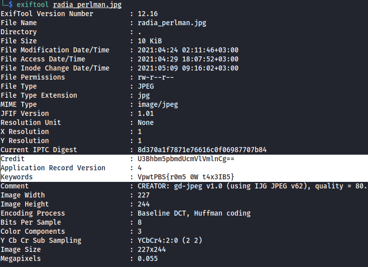
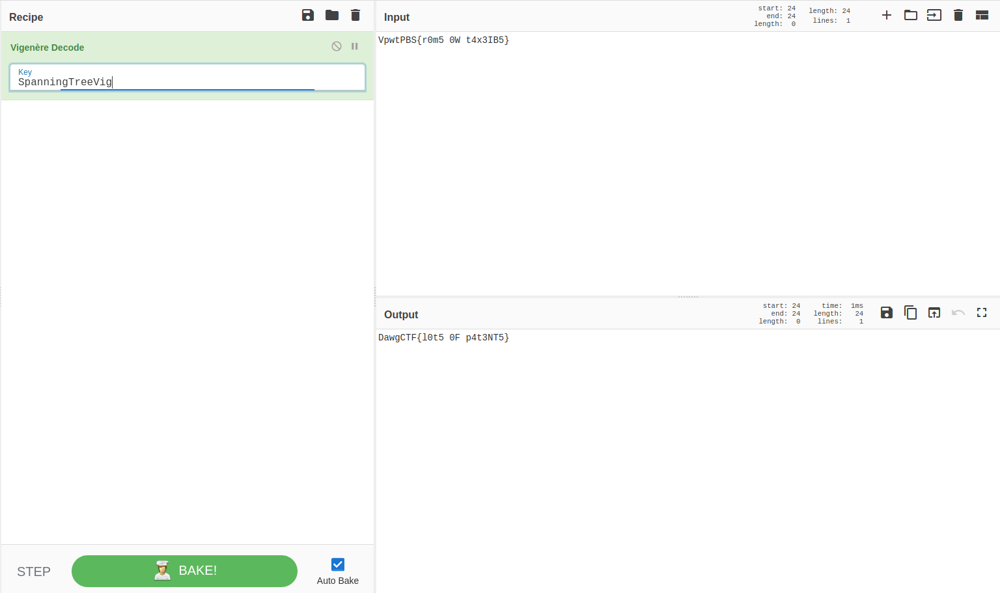

# These Ladies Paved Your Way
## Challenge
Type: Forensics
```
Per womenintech.co.uk, these 10 women paved your way as technologists. One of them holds more than 100 issued
patents and is known for writing understandable textbooks about network security protocols.
What other secrets does she hold?
```
[WomenInTech.zip](src/WomenInTech.zip)

## Solve
We have images inside the zip, let's use exiftool and see if we get any useful information.

```
Credit                          : U3Bhbm5pbmdUcmVlVmlnCg==
Keywords                        : VpwtPBS{r0m5 0W t4x3IB5}
```
Just by looking the "Credit"s value, we can understand it's base64 encoded, let's decode and see what exactly it is.
```
SpanningTreeVig
```
Hmm, Ok. We have an encoded flag, and a string that might be key... Also as we see DawgCTF{} format is protected. That means, it encodes letter by letter whatever the encoding algorithm is.

It seems like as if it's Vigenère cipher. Let's try to decode `VpwtPBS{r0m5 0W t4x3IB5}` using vigenère and `SpanningTreeVig` as key.



We've successfully captured the flag!! ``DawgCTF{l0t5 0F p4t3NT5}``

***Written by f4T1H***
